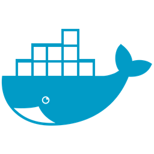

<h2>Hey!! Hola!! </h2>

Mi nombre es Javier Lobo y soy programador desde hace mucho tiempo. A lo largo de mi vida he programado en distintos lenguajes de programación como Cobol, Pascal (Delphi), C++ o Visual Basic (.Net) pero estos últimos años he decidido especializarme en Java y microservicios bajo el framework de Spring Cloud Netflix.  
Me puedes encontrar en las siguientes redes sociales que suelo usar:

 

## Algunas cosas personales de la que te puedo hablar
- 🔭 Actualmente estoy trabajando con cosas guais que molan mucho.
- 🌱 Soy autodidacta y continuo aprendiendo nuevas tecnologías que me ayudan a mejorar día a día.
- 📫 Puedes contactarme por: **Linked In**

## Lenguajes y herramientas
#### Herramientas
- Git, VSCode, Eclipse
#### Front-End
- Angular, JSP, HTML5, CSS3, Javascript, API Restful, Bootstrap
#### Back-End
- Java 8, Spring boot, Spring jpa, hibernate, 

#### Bases de datos
- Oracle Pl/Sql, MySql, Mongo
